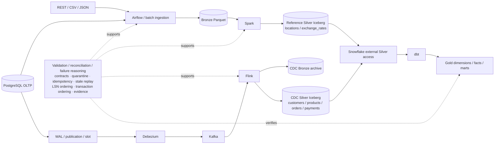

# Finalization Documentation

This directory is the authoritative final-V1 documentation layer. It records
implemented and offline/static evidence; physical integration is runtime deferred
to V1.x. `docs/study/` is supplementary material, not the source of truth.

## MDEP V1 Architecture Map

**V1:** IMPLEMENTED + OFFLINE / STATICALLY VALIDATED.  
**V1.x:** PHYSICAL RUNTIME INTEGRATION DEFERRED — not runtime validated.

### Architecture walkthrough

#### 1. Source layer

PostgreSQL is the commerce transactional source (`source-data/postgres/schema.sql`);
REST and CSV/JSON provide reference inputs. PostgreSQL tables own customers,
products, orders, and payments. Orders have no `location_id`, so no fabricated
order-location relationship exists. Source contract/fixture behavior is offline
tested; live source services are runtime deferred.

#### 2. Batch ingestion and Bronze

`orchestration/dags/bronze_ingestion.py` schedules batch work, while
`ingestion/batch/pipeline.py` and `bronze.py` extract, enrich, and land records.
Airflow orchestrates rather than transforms. Bronze uses deterministic ingestion
identity, Parquet publication, and quarantine evidence. `tests/test_bronze_ingestion.py`
covers identity/retry/quarantine logic; physical Airflow/object-store execution is deferred.

#### 3. PostgreSQL CDC, Debezium, and Kafka

`cdc-init.sql` defines publication scope; the connector JSON uses pgoutput,
explicit publication/slot, tombstones, and `provide.transaction.metadata=true`.
Kafka transports events but does not decide source freshness. Connector contracts
are tested in `tests/test_cdc_contracts.py`; registration and observation are deferred.

#### 4. Spark versus Flink processing

Spark handles bounded reference data only (`exchange_rates`, `locations`), while
Flink applies keyed CDC current state for commerce entities. `incoming_is_newer`
uses business/extraction/ingestion/hash ordering; `version_decision` uses LSN,
same-transaction order, and known replay identity. This prevents competing Silver writers.

#### 5. Silver Iceberg and canonical ownership

Spark writes reference Silver; Flink writes CDC Silver and raw CDC Bronze. Iceberg
is their common table boundary, not a third processing engine. Stale replay,
exact replay, and conservative equal-position conflict rules are offline-tested;
physical catalog/sink behavior is runtime deferred.

#### 6. Snowflake/dbt Gold analytics

`warehouse/snowflake/01_setup.sql` declares external Silver access. dbt consumes
it through staging/intermediate models and owns Gold dimensions, facts, and marts.
`fct_orders` is incremental; `fct_payments` intentionally rebuilds so deletes and
relinks remain correct. Warehouse/dbt contracts are static/offline evidence only.

#### 7. Validation, reconciliation, and failure boundaries

`validation/` contains quality gates, failure cases, reconciliation templates, and
an evidence runner. Quarantine, idempotency, stale replay, LSN/transaction order,
and Gold quality are explicit checks. A PASS requires exit code zero plus evidence;
full cross-service execution remains a V1.x activity.

## How to Explain This Diagram in an Interview

**30 seconds:** walk left to right: sources split into batch and CDC, converge at
Silver Iceberg, then Snowflake/dbt owns Gold; name Spark and Flink as the two
canonical Silver writers for separate domains.

**2 minutes:** explain why reference batch and stateful CDC use different engines,
how Bronze preserves replay evidence, and how external Silver/dbt separates
analytics from ingestion ownership.

**Senior follow-up:** point to stale replay ordering, LSN versus Kafka offset,
same-transaction ordering, quarantine, reconciliation, and the distinction between
exactly-once configuration and runtime proof.

## Recommended order

1. [Architecture ↔ Implementation Mapping](architecture-implementation-mapping.md)
2. [End-to-End Data Flow](end-to-end-data-flow.md)
3. [Data Model and Grain](data-model-and-grain.md)
4. [Key Design Decisions](key-design-decisions.md)
5. [Offline Validation Coverage](offline-validation-coverage.md)
6. [Failure and Recovery Reasoning](failure-and-recovery-reasoning.md)
7. [Production Gap Analysis](production-gap-analysis.md)

Use [Code Reading Guide](code-reading-guide.md) to return to source,
[Interview Q&A](interview-qa.md) for rehearsal, and
[Interview Cheat Sheet](interview-cheat-sheet.md) immediately before an interview.

**30 minutes:** README, architecture mapping, data flow, cheat sheet.

**2 hours:** add data model, design decisions, validation coverage, and one code
track. **Deep study:** read every item beside its cited code/tests, then use the
Study Pack for additional concepts.
