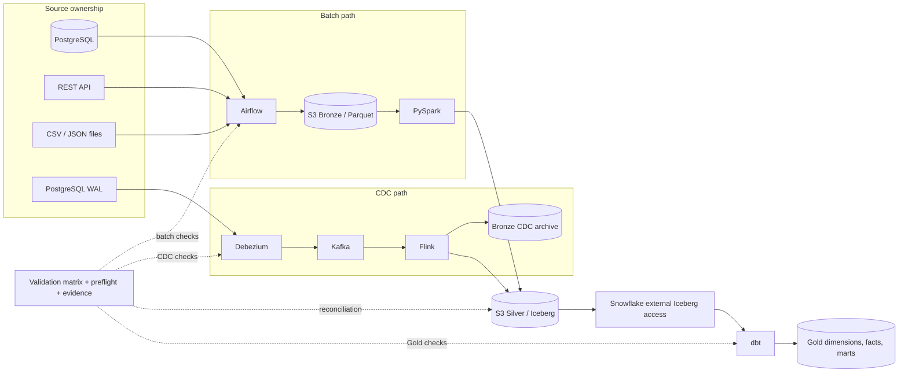

# Project evidence — MDEP-13

This factual closing inventory does not claim every runtime path has been exercised. The validation framework is **IMPLEMENTED**; physical integration evidence is recorded only under `validation/evidence/<run-id>/` after a run.

## Evidence status

| Component | IMPLEMENTED | STATICALLY VALIDATED | RUNTIME VALIDATED | BLOCKED / UNVALIDATED |
| --- | --- | --- | --- | --- |
| Airflow batch/Bronze | DAG, Compose runtime, MDEP-8 validator | Python/contract tests | No | Docker/Airflow/PostgreSQL run unexecuted |
| Spark/Silver Iceberg | batch job and deterministic merge rules | ordering contracts | No | Java, Spark, Iceberg runtime/input unavailable |
| Debezium/Kafka | connector configuration and validator | connector contracts | No | connector/topics/events unexecuted |
| Flink/CDC | CDC model, job, Compose assets, validator | CDC ordering/model tests | No | Docker, S3, job, checkpoint, and sink evidence absent |
| Iceberg/S3 | catalog-compatible configuration and external-table DDL | static contracts | No | shared catalog/object store/snapshots unexecuted |
| Snowflake/dbt | external access template and Gold models | warehouse/dbt contracts | No | credentials, dbt execution, and Snowflake queries unavailable |
| MDEP-13 framework | matrix, preflight, runner, reconciliation, failure catalog | MDEP-13 framework tests | No runtime evidence implied | execute from suitable environment |

MDEP-8 through MDEP-12 runtime debt is preserved in `validation/mdep-13-validation-matrix.yml`; MDEP-13 does not erase it.

## Final architecture and evidence points

Ownership is unchanged: Airflow owns batch Bronze, Spark owns batch Silver, Flink owns CDC/event Silver and CDC Bronze archive, and dbt owns Gold.
