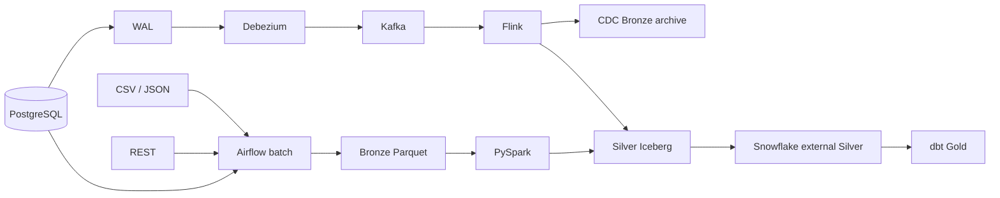

# MDEP V1 Master Architecture

## Problem and domain

Commerce & Operations has relational customers/products/orders/payments, externally supplied exchange rates and locations, and CSV/JSON reference files. The portfolio question is not “which tool can ingest data?”; it is how to preserve source evidence, build one trustworthy current-state representation, and expose a usable analytical model without creating competing writers.

## Lifecycle and ownership

| Layer | Purpose | Canonical writer | State |
| --- | --- | --- | --- |
| Bronze | source-aligned replay evidence | Airflow or Flink | append-oriented history |
| Quarantine | rejected evidence with reason | ingestion/processing path | append-oriented |
| Silver | trusted, typed, conformed state | Spark reference entities; Flink CDC entities | current state |
| Gold | analytical facts/dimensions/marts | dbt in Snowflake | consumer model |

The batch path is PostgreSQL/REST/files → Airflow → Bronze Parquet → Spark → Iceberg → Snowflake/dbt → Gold. The CDC path is PostgreSQL WAL → Debezium → Kafka → Flink → CDC Bronze plus Iceberg Silver → Snowflake/dbt → Gold. This is both ETL (Bronze-to-Silver processing) and ELT (SQL transformations inside Snowflake); the distinction is execution location, not a quality hierarchy.

## Choices, reliability, and boundaries

Parquet is a columnar file format, not a transactional table. Iceberg supplies snapshots, metadata and atomic table commits. Snowflake reads externally managed Silver and owns native Gold; it is not a second Silver writer. Airflow schedules bounded work; Spark processes bounded datasets; Kafka transports retained records; Flink applies unbounded keyed change state. Current state is deliberately different from append history, so cross-layer row counts alone are not reconciliation.

Replay and at-least-once delivery are expected. Batch reference Silver accepts a row only when its full version tuple is newer; CDC Silver uses source LSN, then same-transaction order, then exact transport identity. Failure boundaries include malformed source input, REST retry exhaustion, duplicate/replayed Bronze, CDC order ambiguity, Iceberg/S3 commit/runtime failure, and warehouse/model quality failure. MDEP-13 records evidence semantics; MDEP-14 preserves runtime debt rather than converting configuration into success.

## Security, cost, and current truth

Credentials are environment configuration, not repository content. Production would constrain S3/IAM access, rotate secrets, monitor retained WAL, Kafka lag, checkpoint health, Iceberg small files, Snowflake credits, and dbt freshness. The code and static tests are present. Docker/Airflow/PostgreSQL, Spark/Iceberg, Debezium/Kafka, Flink/S3, Snowflake/dbt, and end-to-end reconciliation remain **RUNTIME UNVALIDATED**.

## Spoken restoration

**30 seconds:** “I built a Commerce & Operations learning platform with a replayable batch path and a CDC path. Airflow lands source-aligned Bronze Parquet, Spark owns batch-reference Iceberg Silver, Debezium/Kafka/Flink owns CDC state, and Snowflake/dbt owns Gold. I made ownership and replay rules explicit and documented the runtime work that still needs evidence.”

For the one- and two-minute versions, use [the final playbook](99-final-interview-playbook.md) and add the MDEP-9 stale-replay and MDEP-13 evidence stories.
