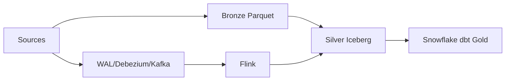

# Module 00 — Architecture overview

**Purpose:** restore the whole Commerce & Operations story before tool detail. Inputs are PostgreSQL, REST, files, and WAL; outputs are Bronze evidence, Silver Iceberg current state, and dbt Gold. Upstream is the source boundary; downstream is analytics. Airflow/Spark own bounded batch work, Debezium/Kafka/Flink own CDC transport and application, and dbt owns Gold. Bronze is history, Silver is current state, Gold is dimensional consumption.

The module solves competing-writer and replay ambiguity through explicit ownership; it does **not** own physical runtime proof, secrets, or production HA. Failure boundary: a source/transport/engine failure must leave recoverable evidence or a recorded blocker. Key takeaways: choose one writer, separate history from state, and distinguish static contracts from runtime acceptance. Interview summary: explain the two paths, then name their different semantics.
