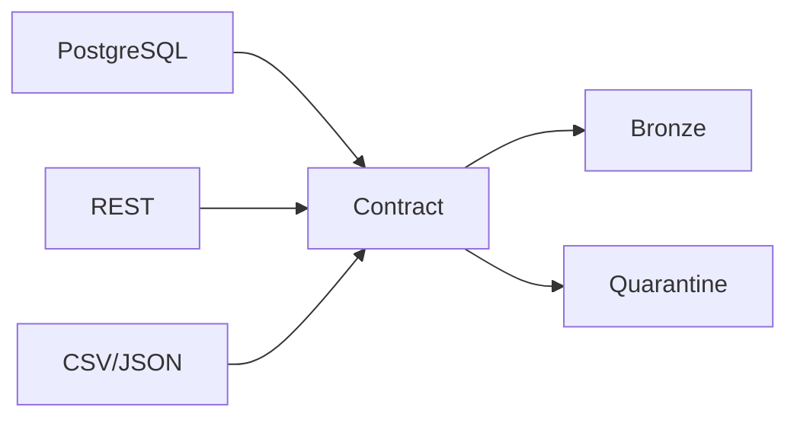

# Module 01 — Data contracts and sources

**Purpose:** define the Commerce & Operations source boundary before data moves. Inputs are PostgreSQL `commerce` tables, REST records, and CSV/JSON files; outputs are contract-conformant records or quarantine evidence. Upstream owners are source systems; downstream consumers are MDEP-8 Bronze and MDEP-10 CDC. PostgreSQL owns relational truth, the REST service owns reference payloads, and files own supplied reference snapshots. State is source state plus append evidence; the data model has business keys, relationships, required fields, timestamps and provenance.

The layer solves ambiguity about grain, ownership and allowed imperfection. It does not own Bronze publication, CDC application, or Gold joins. A failure is malformed/missing/duplicate input or a broken source relationship. **Key takeaway:** source data is evidence, not automatically trusted data. **Interview:** distinguish a source contract from downstream validation.
