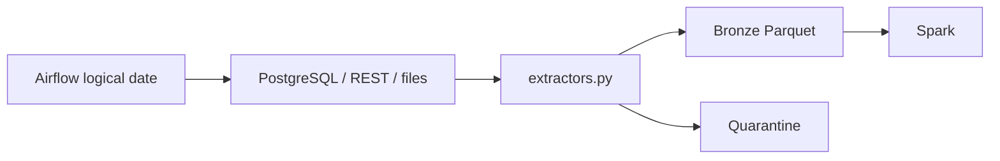

# Module 02 — Airflow and batch ingestion

**Purpose:** coordinate bounded extraction and deterministic Bronze landing. Inputs are PostgreSQL snapshots, paginated REST responses and CSV/JSON; outputs are source-aligned Parquet plus JSONL quarantine. Upstream is module 01; downstream is Spark Silver. Airflow owns task scheduling and dependency/retry policy, while `ingestion/batch` owns extraction/publication. State is a logical data interval and deterministic `ingestion_id`, not a mutable transformation state.

This solves repeatable batch coordination; it does not own Spark transformations or CDC. Failure boundary is a source page/task/publication failure. **Takeaway:** a retry must resolve to the same logical operation. **Interview:** Airflow orchestrates work; it is not the transformation engine.
