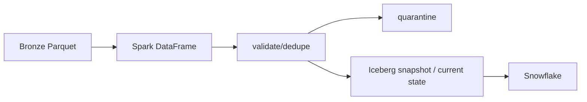

# Module 03 — Spark and Iceberg

**Purpose:** turn bounded, replayable REST Bronze into trustworthy reference Silver. Inputs: `exchange_rates` and `locations` Parquet; outputs: Iceberg `ref_exchange_rates`, `ref_locations`, plus Silver quarantine. Upstream: MDEP-8; downstream: Snowflake/dbt. Spark is the canonical writer only for these reference entities; Flink owns CDC entities. State model: current row per natural key, versioned by a documented tuple. Data model: rate date/base/quote and location ID with normalized attributes.

It solves large-scale typed transformation plus atomic state updates; it does not own CDC tables, Gold, or physical S3 success. Failure boundary: parser/validation/shuffle/merge/catalog error. Takeaway: Parquet files are not a current-state table. Interview: explain version order before saying MERGE.
