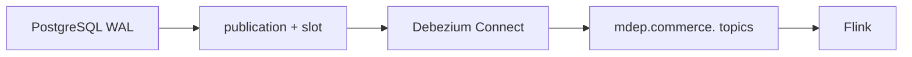
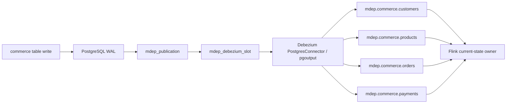
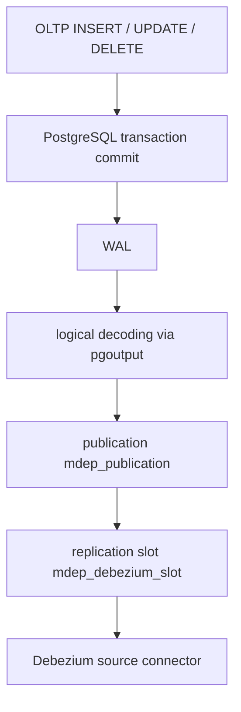
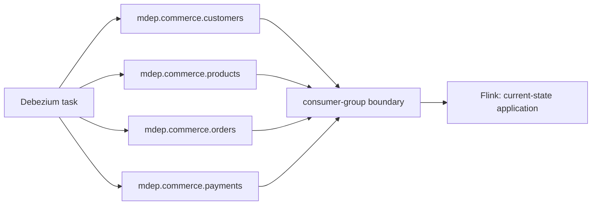
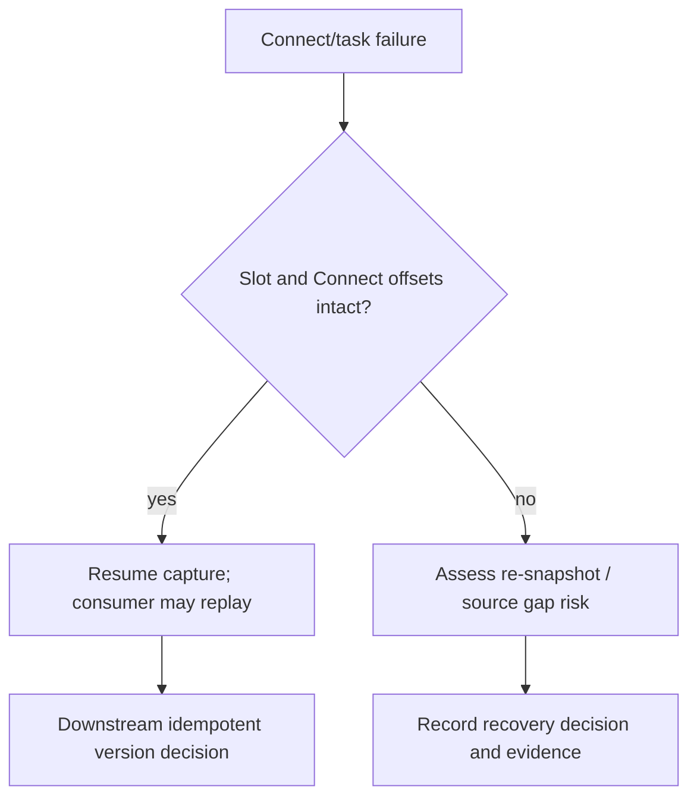

# Module 04 — PostgreSQL CDC, Debezium and Kafka

**Purpose:** transport PostgreSQL mutations from WAL to durable Kafka topics. Input is logical decoding for four `commerce` tables; output is keyed Debezium envelopes and optional transaction metadata. Upstream: PostgreSQL publication/slot; downstream: Flink. PostgreSQL owns WAL, Debezium Connect owns capture, Kafka owns retained partitioned transport; neither owns Silver state. State is source LSN/slot and consumer offsets; data is before/after/source/op envelope.

It solves change capture without table polling. It does not prove global ordering, apply current state, or eliminate duplicates. Failure boundary: slot/WAL retention, connector failure, schema change, broker/topic/consumer failure. **Takeaway:** partition order is local. **Interview:** LSN is source position; Kafka offset is transport position.

## Boundary and ownership map

| Component | Inputs | Outputs | Owns | Explicitly does not own |
| --- | --- | --- | --- | --- |
| PostgreSQL | OLTP writes | WAL records | transaction commit/source truth | Kafka delivery/current Silver |
| publication + slot | logical WAL | decoder feed/resume point | allowed tables/retained position | consumer transformation |
| Debezium Connect | pgoutput row changes | JSON envelope topics | source capture/snapshot | business current state |
| Kafka | keyed records | retained partition log | transport/replay/consumer offsets | global DB order |
| Flink (next module) | envelopes | Bronze/Silver changelog | state application | source capture |

The four CDC-owned data models are customers (`customer_id`), products (`product_id`), orders (`order_id`) and payments (`payment_id`). Their source schema is relational OLTP state; the emitted envelope is change history. One primary-key key groups records for one entity row, but topic/partition boundaries still prevent a global cross-topic database order.

## Why this layer exists

Periodic `updated_at` polling can be useful for bounded extraction, but it cannot naturally show a committed delete or all intermediate mutations. Debezium reads WAL using the source’s own change log, allows initial snapshot bootstrap, and resumes from a replication slot. Kafka separates capture from downstream consumers and retains records for replay. The operational price is substantial: source privileges, WAL retention, connector lifecycle, topic lag, schema compatibility and downstream idempotency all become part of the system boundary.

## State model and failure boundary

At the source, LSN/transaction boundary defines mutation ordering. At the connector, snapshot and source position determine capture progress. At Kafka, topic/partition/offset defines transport position and consumer progress. MDEP deliberately avoids treating the latter as source freshness. A source outage, stalled Connect task, broker failure, malformed envelope, schema change, retained-WAL exhaustion or replayed record crosses a boundary where a later consumer must either preserve evidence, reject ambiguously ordered input or recover from an explicit checkpoint/offset plan.

## Architecture diagram

## Runtime truth

All source/configuration artifacts and connector-contract tests are present. The Compose topology is a one-node KRaft Kafka lab with RF=1 and Debezium 3.0 Connect. Actual registration, snapshot, stream, tombstone, transaction metadata, restart and consumer replay are **RUNTIME DEFERRED — not runtime validated**. This distinction is central to an interview-quality explanation.

## PostgreSQL logical-replication boundary

PostgreSQL owns transactional commerce state and the durable WAL. The publication defines *which* tables are exposed, and the slot defines a recoverable consumption position. Debezium expects that source boundary to be correct; it must not infer a business key, repair an invalid OLTP relationship, or decide a consumer’s analytical grain. Logical decoding is row-change oriented. It is not physical replication: physical replication copies storage-level WAL for a PostgreSQL replica, whereas this path gives a connector interpretable change records.

## Debezium-to-topic boundary

Debezium owns source capture and converts decoded changes into envelopes. Kafka owns retained, partitioned transport and consumer offsets. A topic is not a database table and a broker offset is not a source version. The downstream consumer boundary is intentional: MDEP-10 finishes after producing an honest transport contract. Flink, in MDEP-11, owns keyed state, stale-event rejection, CDC Bronze archive and Iceberg updates. MDEP-10 does **not** own those layers, Snowflake, dbt, or Gold.

## Restart and recovery boundary

Connector recovery has two independent state domains: the PostgreSQL slot and Kafka Connect offset storage. Reusing both normally allows resumption, but downstream delivery may still be at-least-once. Losing either is not automatically harmless: an old slot can retain WAL, a missing slot may require a new snapshot, and lost Connect offsets can change where capture resumes. MDEP documents this as an operational exercise; it does not automate a destructive recovery path.

## Key takeaways

1. CDC begins with database configuration and source ownership, not a Kafka topic.
2. A slot is both a recovery aid and a retained-WAL risk.
3. Debezium envelope metadata describes source changes; it does not itself materialize current state.
4. Kafka provides ordered records within a partition and replayable retention, not global source freshness.
5. The connector is configured and statically checked, while runtime observation is **RUNTIME DEFERRED — not runtime validated in V1**.
