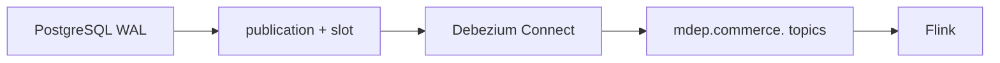

# Module 04 — PostgreSQL CDC, Debezium and Kafka

**Purpose:** transport PostgreSQL mutations from WAL to durable Kafka topics. Input is logical decoding for four `commerce` tables; output is keyed Debezium envelopes and optional transaction metadata. Upstream: PostgreSQL publication/slot; downstream: Flink. PostgreSQL owns WAL, Debezium Connect owns capture, Kafka owns retained partitioned transport; neither owns Silver state. State is source LSN/slot and consumer offsets; data is before/after/source/op envelope.

It solves change capture without table polling. It does not prove global ordering, apply current state, or eliminate duplicates. Failure boundary: slot/WAL retention, connector failure, schema change, broker/topic/consumer failure. **Takeaway:** partition order is local. **Interview:** LSN is source position; Kafka offset is transport position.
