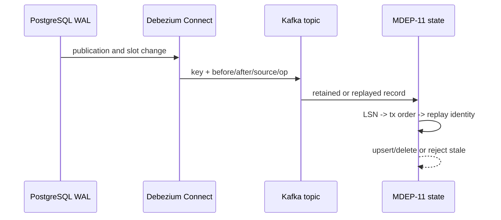

# Module 04 — Data flow and runtime

When `order_id=1001` changes from `created` to `completed`, PostgreSQL appends a WAL record. The publication/slot lets Debezium emit an update envelope with `before`, `after`, `source` including LSN, and `op=u` on `mdep.commerce.orders`, keyed by the primary key. An initial row is `r`; a delete is `d` and can be followed by a null tombstone. Kafka retains messages for replay; a restart can redeliver them. Metadata may identify transaction/order where supported, but no connector registration, BEGIN/END event or topic observation has executed: all are **RUNTIME DEFERRED — not runtime validated**.

## End-to-end CDC trace: `customers:cust-cdc-1`

The MDEP-10 validator inserts `cust-cdc-1`, updates `customer_status`, and deletes it. PostgreSQL writes each committed mutation to WAL. Because Compose sets `wal_level=logical` and `cdc-init.sql` created `mdep_publication`, `pgoutput` can expose row changes to the configured connector. This source preparation is **IMPLEMENTED**; no physical decoding result is asserted.

On a new connector, `snapshot.mode=initial` produces baseline `op=r` records. The subsequent insert/update/delete are `c/u/d`; delete has `after=null`. Debezium derives `mdep.commerce.customers` from prefix/schema/table and should use the primary key as record key. Its envelope can carry `before`, `after`, `source.lsn`, source transaction values and—when supported—Debezium transaction fields. The repository configures `provide.transaction.metadata=true`, but no resulting metadata or BEGIN/END record has been observed.

Kafka retains the messages. A fresh consumer group or restart may replay an old update with a later Kafka offset. That is not a newer database version. MDEP-11 uses source LSN, then same-transaction `total_order`, then exact known transport identity to decide current state. If a lower-LSN update returns after a restart, it must not regress Silver. A null tombstone that follows delete is a compaction marker, not a second business deletion.

An envelope missing LSN, using an unsupported operation, naming a non-owned table, or carrying delete with non-null `after` is invalid. The parser rejects it; the physical Flink topology is designed to preserve raw evidence and quarantine malformed input. Connector outage is different: it can cause replication-slot WAL retention. Recovery begins with connector status, slot progress and source disk health; blindly dropping the slot can force re-snapshot/gap decisions.

| Stage | Evidence available | Accurate wording |
| --- | --- | --- |
| source/configuration | SQL, JSON, tests | “I configured logical CDC.” |
| CRUD/restart exercise | PowerShell validator | “I designed the runtime validation.” |
| connector/topic/transaction output | no evidence on host | “Runtime deferred; not runtime validated.” |
| downstream ordering | MDEP-11 source/tests | “Implemented and statically tested.” |

## Multi-row transaction: why one order field is not enough

The validator opens a PostgreSQL transaction, updates `prod-100`, updates `prod-200`, then commits. At database level these writes share one commit boundary. A consumer that sees equal or closely related source positions cannot safely use Kafka partition number to decide which row image is later. Where Debezium emits transaction metadata, `transaction.id` groups the work, `transaction.total_order` supplies transaction sequencing, and `transaction.data_collection_order` describes collection ordering context. Snapshot `r` records may not have this metadata, so an initial state must not be treated as if it had a normal streaming transaction contract.

MDEP downstream handling is deliberately narrower than a general transaction processor: source LSN is primary; same-transaction total order is used only when both IDs/orders are present; unknown equal position becomes a conservative conflict. This protects current state even if it means surfacing ambiguity for review.

## Schema evolution scenario

The validator adds `preferred_language` to `commerce.customers` and updates `cust-100`. The source change is additive, but it still changes the `after` object contract. Capture may successfully emit JSON while a downstream typed consumer fails or silently ignores the field. MDEP-10 treats this as a contract exercise: it preserves the source envelope and requires consumers to decide how to support an additive field. Module 05 has an explicit `preferred_language` mapping. Runtime connector and consumer schema evolution remain unvalidated.

## Slot-lag scenario

If Connect is stopped for days, PostgreSQL may retain WAL because `mdep_debezium_slot` has not advanced. `confirmed_flush_lsn` indicates confirmed progress; comparing it conceptually with `pg_current_wal_lsn()` reveals lag. The immediate concern is source disk pressure, not only stale analytics. An operator would inspect Connect status and source disk, restore capture safely, then verify the resume/replay boundary. The project supplies these inspection commands but contains no observed lag measurement.
