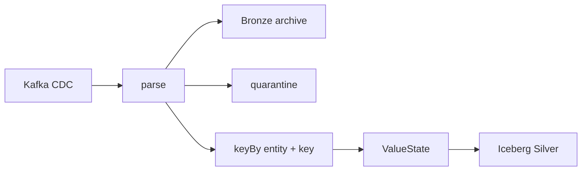

# Module 05 — Flink stateful streaming

**Purpose:** turn unbounded Debezium topic records into replayable CDC Bronze, quarantine evidence and keyed Silver current state. Inputs are four Kafka CDC topics; outputs are Parquet archive/quarantine and Iceberg changelog/current tables. Upstream: MDEP-10; downstream: Snowflake/dbt. Flink owns state application for CDC entities. State model is last applied source position and current row per `entity|primary_key`; data model preserves Debezium before/after, LSN, transaction/order and Kafka coordinates.

It solves unbounded, keyed mutation application; it does not make event time a freshness rule or prove exactly once. Failure boundary: malformed envelope, duplicate/stale/ambiguous position, checkpoint/restart, sink. **Takeaway:** source order and transport identity are distinct. **Interview:** explain LSN before watermarks.
