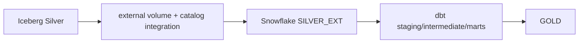

# Module 06 — Snowflake and dbt analytics

**Purpose:** expose externally managed Iceberg Silver to Snowflake and create Snowflake-native Gold dimensions, facts and marts. Inputs are external Silver tables; outputs are `MDEP.GOLD` dbt models/tests. Upstream: Spark/Flink Silver; downstream: analysts. Iceberg writers retain Silver ownership; Snowflake owns access metadata/compute and dbt-owned Gold. State is current-state Type 1 analytics; model grain is explicit per table.

It solves governed analytical SQL and dimensional consumption; it does not write Silver or invent missing relationships. Failure boundary: IAM/external metadata, SQL/model/test/freshness/cost failure. Takeaway: Gold grain comes before incremental strategy. Interview: explain external Silver vs native Gold.
