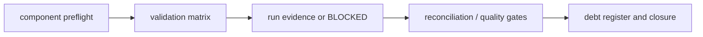

# Module 07 — Reliability and validation

**Purpose:** make V1 claims auditable without adding an observability platform. Inputs are existing validators, logs, evidence paths and reconciliation query templates; outputs are a validation matrix, run-specific evidence and an honest closure/debt register. Upstream: every MDEP-6–13 component; downstream: portfolio/Jira decisions. MDEP-13 owns validation evidence semantics and MDEP-14 owns closure classification, not data-plane state.

It solves false confidence from code-only checks. It does not manufacture runtime results. Failure boundary: unavailable environment, failed validator, stale/missing evidence, inconsistent cross-layer result. **Takeaway:** `BLOCKED` and `NOT_RUN` are facts, not failures to hide. **Interview:** say what evidence would close a claim.
